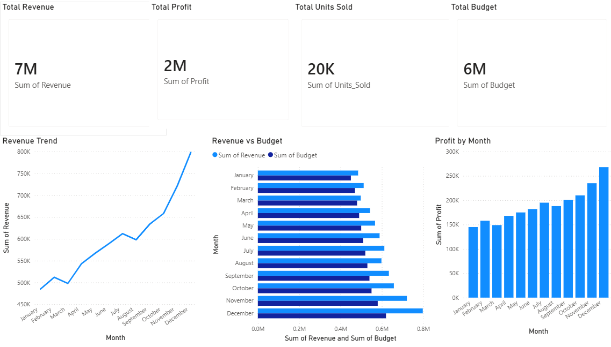

# Financial KPI Dashboard — Power BI

## Project Overview
Interactive Financial KPI Dashboard built in Power BI tracking 
Revenue, Profit, Budget, and Units Sold across 12 months — 
designed for executive management reporting.

## Tools & Skills
- Power BI Desktop — Cards, Line Chart, Bar Chart, DAX
- Financial Analysis — Revenue vs Budget comparison
- KPI Reporting — Monthly trend analysis
- Business Intelligence — Executive dashboard design

## Key Business Insights
- Total Annual Revenue: £7M across 12 months
- Total Profit: £2M — healthy profit margin
- Revenue grew consistently from £485K (Jan) to £798K (Dec)
- December peak: £798K revenue — 64% above January
- Revenue consistently exceeded Budget every month
- Profit grew 85% from January to December

## Dashboard Screenshot

## Author
**Kabilan Ramachandran**  
linkedin.com/in/kabilan-ramachandran  
github.com/kabilanramachandran
